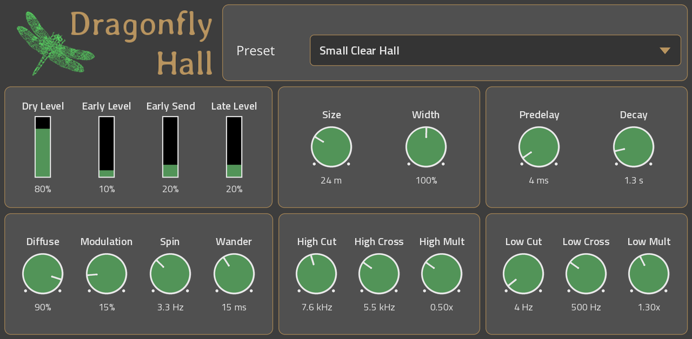
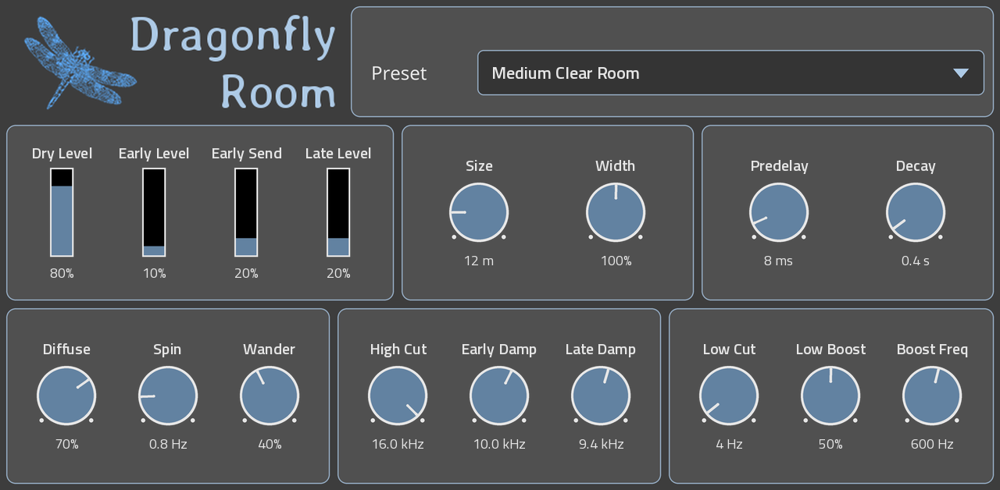
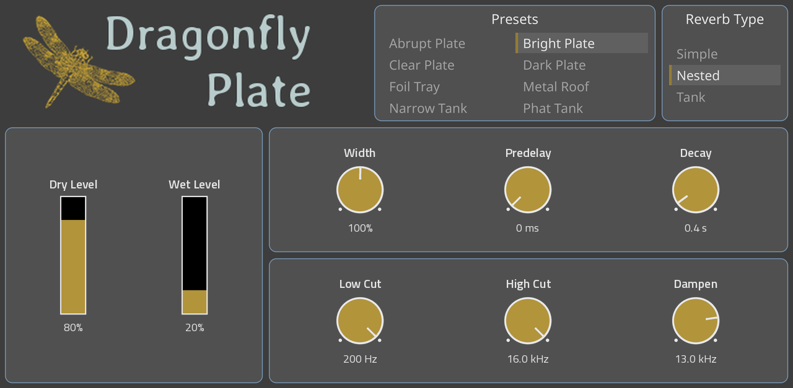
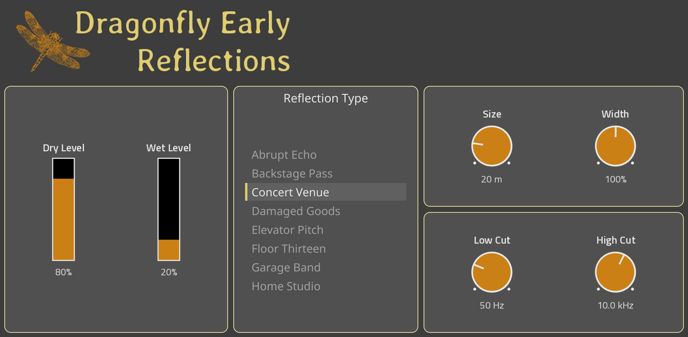

# Dragonfly Reverb for MPC OS

An unofficial port of the four [Dragonfly Reverb](https://github.com/michaelwillis/dragonfly-reverb) plugins (3.2.10) by Michael Willis and
Rob van den Berg, ported as native insert effects for **Gen 1 Akai MPC and Akai Force** standalone devices. Each has a
touchscreen page modelled on the original plugin's UI, Q-Link mapping, its presets, and full project recall.



| Plugin (manufacturer "Dragonfly") | Presets |
|---|---|
| **Hall** | 25, in 5 banks; Q-Link banks MAIN and EQ |
| **Room** | 25, in 5 banks; Q-Link banks MAIN and TONE |
| **Plate** | 8, plus 3 reverb types |
| **Early Refl** (Early Reflections) | 8 reflection types |

## Install
Download `Dragonfly-Reverb-for-MPC-OS-<version>.zip` from [Releases](../../releases).

The plugins work on **Gen 1 Akai MPC and Akai Force** units (Force, MPC Live, Live II, One, X, Key 61) with SSH
access through custom firmware. They are registered with `vstscanner.sh` from the Force VST distribution; copy it
along with the plugins.

The steps below are written for the **Akai Force with MockbaMod**, which mounts its memory card at
`/media/662522`. On other custom firmware (for example Hakai), or without that `662522` card, use
[Other firmware](#other-firmware-or-no-662522-card) instead.

### Akai Force with MockbaMod (card at /media/662522)
1. Copy the eight folders from the collection's `Dragonfly Plugins` folder into the `Synths` folder on the memory
   card, next to `vstscanner.sh`: the four `dragonfly.vst.*` folders (the plugins) and the four
   `Dragonfly - VST - ...` folders (their pages). The page folders must sit directly in `Synths`, not inside
   another folder.
2. Run the scanner: `ssh ip-of-force 'sh /media/662522/Synths/vstscanner.sh'`
3. MPC restarts. The plugins are under the VST category, manufacturer "Dragonfly".

### Other firmware, or no 662522 card
The scanner needs two paths: the folder holding the plugins, and MPC's settings file. Find yours first.

1. SSH into the device and find where to put the plugins:
   - a memory card: `ls /media` lists the mounted cards (the internal drive is `az01-internal`); or
   - the internal storage: `/sdcard` (the plugins can run from there).
   Below, `<dir>` means that location plus `/Synths`, e.g. `/media/MYCARD/Synths` or `/sdcard/Synths`.
2. Find the settings file: `find / -name MPC.settings 2>/dev/null`. It is usually
   `/media/az01-internal/Settings/MPC/MPC.settings`. Below, `<settings>` means that path. Back it up:
   `cp "<settings>" "<settings>.bak"`
3. Create `<dir>` and copy `vstscanner.sh` and the eight folders into it (as in step 1 above).
4. Run the scanner with both paths: `sh <dir>/vstscanner.sh <dir> <settings>`
   (Without them it assumes MockbaMod's `/data/Settings/MPC/MPC.settings` and stops if that isn't there.)
5. MPC restarts and the plugins appear under VST. If a plugin shows MPC's plain parameter list instead of its own
   page, MPC doesn't look for pages in `<dir>`: check `grep SynthContentLocations "<settings>"` and copy the four
   `Dragonfly - VST - ...` folders into one of the folders it lists (usually `/sdcard/Synths`).

To restore the old plugin list, stop MPC (`systemctl stop acvs`), copy the backup back, and start it
(`systemctl start acvs`).

The collection's own README repeats these steps and covers updating and removing plugins.

### Updating
Copy the eight folders over the old ones, then run the scanner again. No need to remove anything.

## Screenshots
| Room | Plate | Early Reflections |
|---|---|---|
|  |  |  |

Rendered from the built pages by `tools/screenshot.py`, at the default settings. The spectrograms are computed at
build time per preset, exactly as upstream's (`vst/spectrogram_dump.cpp` + `vst/df_paint.py`), and follow the
selected preset.

## Status
Alpha. Everything is tested offline (below), including the real ARM binaries under emulation, and the plugins run on
a Force; the MPC models share the same OS and plugin host. CPU load per instance has not been measured yet; Hall is the heaviest of the four.

## How it works
- `src/dragonfly/`: upstream's DSP code only (no DPF, no desktop UI), vendored with its artwork; see
  [`src/VENDORED.md`](src/VENDORED.md) for the exact commit and the one local fix. `src/shim/` stands in for the
  three DPF headers the DSP includes.
- `vst/dsp_glue.cpp`: the only file that sees upstream's headers; a small C API per plugin (`vst/dsp_glue.h`).
- `vst/dragonfly_vst.cpp`: a hand-written VST2 **effect** wrapper (stereo in/out, no Steinberg SDK), with the
  parameter conventions of [mpc-vst-plugins](https://github.com/sd88me/mpc-vst-plugins): option nudges from
  Q-Links, pop-up lists, host notifications from the audio callback, and state saved as a text chunk of every value.
- Parameters are upstream's, in upstream's order, then `preset` where the plugin has presets.
  `vst/dump_params.cpp` writes each `params.json` from upstream's `DistrhoPluginInfo.h`, so the list can't drift.
  Never reorder them: MPC stores values by index.
- Pages: `vst/df_skin.py` holds one page spec per plugin and writes `vst/<p>/layout.conf` (generated; edit the
  spec). The kit's `gen_vst.py` builds the skin, then `vst/df_paint.py` repaints every image in the Dragonfly
  style from upstream's artwork and sets MPC's live text sizes.
- Target: armv7-a, VFPv3-D16, hard-float, Thumb-2; the C++ runtime is linked in; only `VSTPluginMain` is exported;
  glibc <= 2.36.

## Build
```
git clone https://github.com/sd88me/mpc-vst-plugins ../mpc-vst-plugins
git -C ../mpc-vst-plugins checkout 39660f2b41c0a6d6e9f8c1f0e19378533d9bbc2f   # the commit CI uses
pip install ziglang==0.16.0 pillow
TOOLCHAIN=zig vst/build.sh          # all four; or: vst/build.sh hall plate
```
Needs python3, a host gcc/g++, and Zig (above; what CI uses). `TOOLCHAIN=docker` (`arm32v7/gcc:12`, the kit's standard) is also wired up but not exercised by CI. Output per
plugin is in `vst/<p>/build/`. Set `MPC_VST` if the kit isn't at `../mpc-vst-plugins`.

## Test
```
sudo apt install qemu-user libc6-armhf-cross     # to also test the real ARM binaries
vst/test.sh
```
`vst/effect_test.c` loads a plugin the way MPC does and checks: instances, the stereo effect ABI, every parameter's
name, display and round trip, option nudges, every preset (loads, reports to the host, renders sane audio), the
pop-up, impulse to finite decaying tail, silence, in-place and legacy processing, odd block sizes, chunk
save/restore, foreign chunks refused, 48 kHz, and a parameter sweep during playback. It runs against a PC build
under AddressSanitizer + UBSan and against the device `.so` files under qemu-arm.

## Package and release
- `tools/package.sh` builds `dist/Dragonfly-Force-VST-Collection-<VERSION>.zip`, `dist/SHA256SUMS` and the release
  notes (from this version's `CHANGELOG.md` section).
- `tools/screenshot.py <plugin> <out.png>` renders a page as MPC lays it out, for `docs/screenshots/`.
- CI (`.github/workflows/build.yml`) builds, tests and packages every push and pull request (the zip is a
  workflow artifact). To release: bump `VERSION`, add its section to `CHANGELOG.md`, commit, then
  `git tag v<VERSION> && git push --tags`; CI publishes the GitHub release with the zip and checksums.

## Credits and licence
Dragonfly Reverb by Michael Willis and Rob van den Berg; freeverb3 by Teru Kamogashira and others; Noto Sans by
Google. Built with [mpc-vst-plugins](https://github.com/sd88me/mpc-vst-plugins). Not affiliated with or endorsed
by the Dragonfly Reverb authors or by Akai Professional / inMusic.

GPL-3.0-or-later ([LICENSE](LICENSE)), as Dragonfly Reverb. Every component, its authors and licence:
[NOTICE.md](NOTICE.md). Release zips include `NOTICE.md` and the licence texts (`licenses/`).
